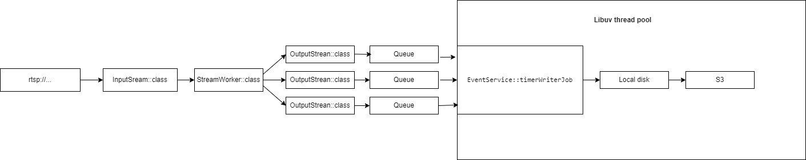

**Source stream**   

| Option      | Description |   
| ----------- | ----------- |   
| src         | Source stream |
| options     | See https://ffmpeg.org/ffmpeg-formats.html#Format-Options          |

**Destination stream**   

Can be many destination stream at source stream

| Option      | Description |
| ----------- | ----------- |
| path*      | File path. Support strftime syntax https://www.cplusplus.com/reference/ctime/strftime/       |
| file_duration_sec   | Time duration one file segment |
| s3_target | s3 profile profile_name |
| bitrate |  Bitrate |
| height | Height video in pixels |
| options | Encode option see https://trac.ffmpeg.org/wiki/Encode/H.264 |

**S3 credentials**  

| Option      | Description |
| ----------- | ----------- |
| profile_name  | Profile profile_name |
| endpoint_url  | The complete URL to use for the constructed client. Normally, botocore will automatically construct the appropriate URL to use when communicating with a service. You can specify a complete URL (including the "http/https" scheme) to override this behavior. If this value is provided, then use_ssl is ignored. |
| access_key_id  | AWS access key ID |
| secret_key  | AWS secret access key |
| bucket_name  | Bucket profile_name |
| verify_ssl  | Whether or not to use SSL. By default, SSL is used. Note that not all services support non-ssl connections |

**Architecture**  
